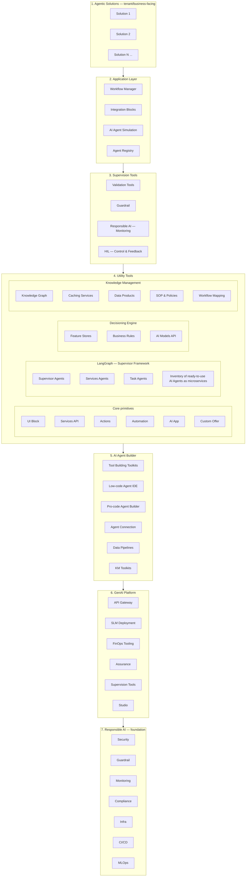
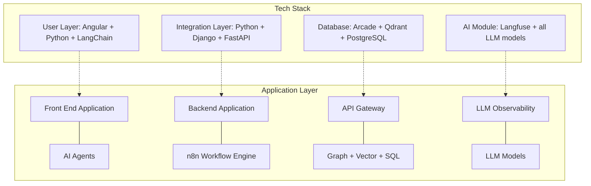
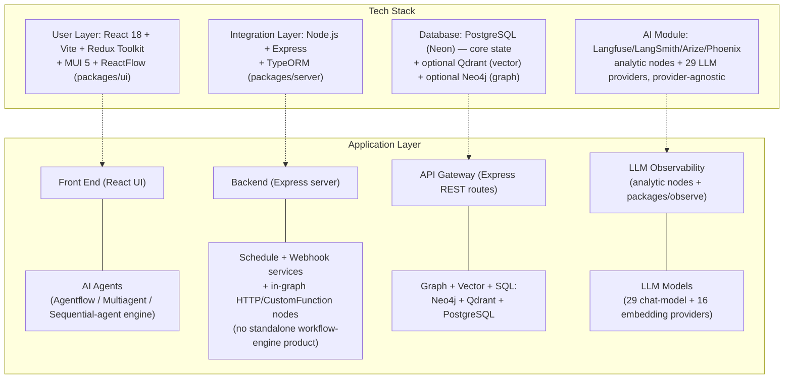

# Architecture: The Reference Plan vs. the Accelance Application

Two architecture pictures, side by side, at the same level of structural detail — no build
status, no effort estimates, just "what is this layer, what does it contain, what
technology realizes it." Left side is the reference architecture from the planning
materials (`agentic-ai-2-plan/` and the live "Reference Architecture" / "DIONCE Technical
Architecture" deck). Right side is this repo's actual architecture, researched fresh
against the current codebase and laid out on the same 7-layer scaffold so the two are
directly comparable box-for-box. Status/build classification for any of this lives in
`rules/epics-feature-status.md`, not here — this file is architecture only.

---

## Part 1 — Reference Architecture (the plan)

### 1a. The 7-layer stack

### 1b. Tech-stack / application-layer wiring ("DIONCE Technical Architecture")

Vertical spine: every request flows **Front End → Backend → API Gateway → LLM
Observability**, traced end to end through Langfuse.

### 1c. Layer detail (what each box means)

| Layer | Box | What it represents |
| --- | --- | --- |
| 1. Agentic Solutions | Solution 1..N | Each concrete business use case is its own tile, reusing everything below without rebuilding it |
| 2. Application Layer | Workflow Manager | Deterministic/orchestrated workflow definitions |
| | Integration Blocks | Reusable connector steps inside a workflow |
| | AI Agent Simulation | Test/preview an agent's behavior before it goes live |
| | Agent Registry | Where agents are defined, versioned, discovered |
| 3. Supervision Tools | Validation Tools | Pre/post-execution checks on agent output |
| | Guardrail | Content/behavior safety enforcement |
| | Responsible AI — Monitoring | Runtime behavior monitoring |
| | HIL — Control & Feedback | Human approval/rejection checkpoints |
| 4. Utility Tools | UI Block / Services API / Actions / Automation / AI App / Custom Offer | Core reusable primitives every agent or workflow can call |
| | LangGraph — Supervisor Framework | The orchestration engine: Supervisor Agents (own control flow) → Services Agents (platform capabilities) → Task Agents (stateless workers), plus a standing inventory of ready-to-use agents as microservices |
| | Decisioning Engine | Feature Stores, Business Rules, AI Models API — deterministic business-logic layer alongside the AI layer |
| | Knowledge Management | Knowledge Graph, Caching Services, Data Products, SOP & Policies, Workflow Mapping — the organizational-knowledge layer feeding RAG and business rules |
| 5. AI Agent Builder | Tool Building Toolkits / Low-code Agent IDE / Pro-code Agent Builder / Agent Connection / Data Pipelines / KM Toolkits | Where agents and tools actually get authored, both visually and by hand |
| 6. GenAI Platform | API Gateway / SLM Deployment / FinOps Tooling / Assurance / Supervision Tools / Studio | The operational platform surface: entry point, small-model tier, cost tooling, evaluation/assurance, ops monitoring, and a prompt/agent studio |
| 7. Responsible AI | Security / Guardrail / Monitoring / Compliance / Infra / CI/CD / MLOps | The foundation everything above sits on |

---

## Part 2 — Accelance Application Architecture (this repo, as built)

Same 7-layer scaffold, populated with what's actually in this codebase — researched fresh
against `packages/server`, `packages/components`, `packages/ui`, `packages/agentflow`,
`packages/observe`, and the deployment config, not carried over from memory.

### 2a. The 7-layer stack, Accelance's real components

```mermaid
flowchart TB
  subgraph AL1["1. Agentic Solutions — tenant-facing"]
    direction LR
    AS1["Chatflow / Agentflow definitions\n(one per business use case)"]
  end

  subgraph AL2["2. Application Layer"]
    direction LR
    AA1["schedule + webhook services\n(cron/webhook-triggered runs)"]
    AA2["HTTP / CustomFunction / ExecuteFlow\nagentflow nodes (integration steps)"]
    AA3["agentflowv2-generator\n(AI-assisted flow generation)"]
    AA4["marketplaces + CustomTemplate\n(agent/template registry)"]
  end

  subgraph AL3["3. Supervision Tools"]
    direction LR
    AS3a["OpenAIModeration / SimplePromptModeration\nnodes (validation/guardrail)"]
    AS3b["HumanInput agentflow node\n(HIL proceed/reject checkpoint)"]
    AS3c["analytic nodes + packages/observe\n(execution-trace monitoring UI)"]
  end

  subgraph AL4["4. Utility Tools"]
    direction LR
    subgraph AU1["Core primitives"]
      direction TB
      AU1a["packages/ui canvas (UI Block)"]
      AU1b["Express REST routes (Services API)"]
      AU1c["Agentflow Action/Automation nodes"]
      AU1d["Custom tool nodes (AI App)"]
    end
    subgraph AU2["Orchestration engine"]
      direction TB
      AU2a["Multiagents: Supervisor / Worker"]
      AU2b["Agentflow V2: Agent/Condition/Loop/Iteration"]
      AU2c["Sequential Agents: State-machine style"]
      AU2d["Marketplace inventory of reusable flows"]
    end
    subgraph AU3["Decisioning"]
      direction TB
      AU3a["Condition / CustomFunction nodes\n(no dedicated rules/feature-store engine)"]
    end
    subgraph AU4["Knowledge Management"]
      direction TB
      AU4a["Neo4j graph node (Knowledge Graph)"]
      AU4b["Cache nodes: Redis/Upstash/Momento/InMemory"]
      AU4c["Document Store service (Data Products)"]
      AU4d["Document loaders (30+ ingestion sources)"]
    end
  end

  subgraph AL5["5. AI Agent Builder"]
    direction LR
    AB1["packages/ui drag-and-drop canvas\n(Low-code IDE)"]
    AB2["CustomFunction/CustomTool authoring\n(Pro-code builder)"]
    AB3["Credential store + OAuth2 routes\n(Agent Connection)"]
    AB4["packages/agentflow\n(embeddable agent-graph React lib)"]
    AB5["packages/observe\n(embeddable execution-trace React lib)"]
  end

  subgraph AL6["6. GenAI Platform"]
    direction LR
    AG1["Express REST API — /api/v1/*\n(API Gateway)"]
    AG2["ChatOllama / ChatLocalAI / ChatLitellm nodes\n(self-hosted model tier)"]
    AG3["Evaluations CostCalculator\n(partial FinOps)"]
    AG4["Evaluations framework: datasets,\nLLM-as-judge (Assurance)"]
    AG5["Prometheus / OpenTelemetry metrics\n(Supervision Tools)"]
    AG6["Langfuse prompt management, if configured\n(Studio)"]
  end

  subgraph AL7["7. Responsible AI — foundation"]
    direction LR
    AR1["Encrypted credential store,\nJWT/session auth (Security)"]
    AR2["Moderation nodes (Guardrail)"]
    AR3["Prometheus/OTel + packages/observe\n(Monitoring)"]
    AR4["— (no dedicated compliance layer today)"]
    AR5["Neon PostgreSQL + Oracle Cloud VM/Docker\nsingle-service deploy (Infra)"]
    AR6["8 GitHub Actions workflows:\nlint/build/test/e2e, Docker image push (CI/CD)"]
    AR7["— (no dedicated MLOps pipeline today)"]
  end

  AL1 --> AL2 --> AL3 --> AL4 --> AL5 --> AL6 --> AL7
```

### 2b. Tech-stack / application-layer wiring (Accelance's actual stack)

Vertical spine, as actually implemented: a prediction request enters at
`routes/predictions` → `controllers/predictions` → `services/predictions::buildChatflow` →
`utils/buildChatflow.ts` (loads the flow + workspace/org context, validates the API key,
checks quota) → the **flow-execution engine** (`utils/index.ts::buildFlow` for
chatflows, or `utils/buildAgentflow.ts` / `utils/buildAgentGraph.ts` for agentflows) —
which dynamically loads each node's compiled implementation from
`packages/components` and walks the flow graph node by node — then persists the result via
`utils/addChatMesage.ts` and streams it back over SSE.

### 2c. Layer detail (what's actually in this repo)

| Layer | Box | Technology / file |
| --- | --- | --- |
| 1. Agentic Solutions | Chatflow / Agentflow definitions | `ChatFlow` entity (TypeORM), one row per flow — each flow is the equivalent of one "solution tile" |
| 2. Application Layer | Workflow Manager equivalent | `packages/server/src/schedule` (cron) + `services/webhook`, `webhook-listener` |
| | Integration Blocks equivalent | `nodes/agentflow/{HTTP,CustomFunction,ExecuteFlow}` |
| | AI Agent Simulation equivalent | `services/agentflowv2-generator` (generates a flow from a prompt/spec) |
| | Agent Registry equivalent | `packages/server/marketplaces/*` (static) + `CustomTemplate` entity (live, per-workspace) |
| 3. Supervision Tools | Validation/Guardrail | `nodes/moderation/{OpenAIModeration,SimplePromptModeration}` |
| | HIL — Control & Feedback | `nodes/agentflow/HumanInput` — real proceed/reject execution checkpoint |
| | Responsible AI — Monitoring | `nodes/analytic/{LangFuse,LangSmith,Arize,Phoenix}` + `packages/observe` (`ExecutionsViewer`, `ExecutionDetail`) |
| 4. Utility Tools — Core | UI Block / Services API / Actions / Automation / AI App | `packages/ui` canvas; Express routes; agentflow Action/Automation-style nodes; custom tool nodes |
| 4. Utility Tools — Orchestration | Supervisor/Services/Task Agents equivalent | `nodes/multiagents/{Supervisor,Worker}`, `nodes/agentflow/*` (Agent/Condition/Loop/Iteration), `nodes/sequentialagents/*` (explicit State nodes) — three parallel implementations of the same supervisor→worker idea |
| | Inventory of ready-to-use agents | Marketplace + `CustomTemplate` |
| 4. Utility Tools — Decisioning | Feature Stores / Business Rules / AI Models API | No dedicated engine — `Condition`/`CustomFunction` agentflow nodes are the closest primitive; model access goes through the chatmodel node layer directly rather than a separate "AI Models API" |
| 4. Utility Tools — Knowledge Mgmt | Knowledge Graph | `nodes/graphs/Neo4j`, `nodes/chains/GraphCypherQAChain` |
| | Caching Services | `nodes/cache/{InMemory,Redis,Upstash,Momento}` |
| | Data Products | `services/documentstore` |
| | SOP & Policies / Workflow Mapping | No dedicated store today |
| 5. AI Agent Builder | Low-code Agent IDE | `packages/ui` drag-and-drop canvas |
| | Pro-code Agent Builder | `CustomFunction`/`CustomTool` node authoring |
| | Agent Connection | `services/credentials`, `routes/oauth2` |
| | Data Pipelines | `nodes/documentloaders/` (30+ sources) |
| | KM Toolkits | `services/documentstore` |
| | (standalone, not in reference plan) | `packages/agentflow` — embeddable agent-graph React library, published independently; `packages/observe` — embeddable execution-trace React library, published independently |
| 6. GenAI Platform | API Gateway | Express REST API, `/api/v1/*`, `packages/api-documentation` (standalone Swagger/OpenAPI docs service) |
| | SLM Deployment | `ChatOllama`, `ChatLocalAI` (self-hosted models), `ChatLitellm` (gateway to any backend) |
| | FinOps Tooling | `services/evaluations/CostCalculator.ts` (partial — per-call, not per-workspace budgets) |
| | Assurance | `services/{evaluations,dataset,evaluator}` |
| | Supervision Tools | `packages/server/src/metrics/{Prometheus,OpenTelemetry}.ts` |
| | Studio | Langfuse prompt management (via the analytic node, when configured) |
| 7. Responsible AI | Security | Encrypted credential store (`utils/index.ts::getEncryptionKey`), JWT/session auth, RBAC (`enterprise/rbac`) |
| | Guardrail | Moderation nodes (same as layer 3) |
| | Monitoring | Prometheus/OTel + `packages/observe` |
| | Compliance | No dedicated layer today |
| | Infra | Neon PostgreSQL, Oracle Cloud Always Free VM (`DEPLOY_ORACLE.md`, Docker Compose) / Docker (`Dockerfile`, single container running server+UI+components) |
| | CI/CD | `.github/workflows/` — 8 pipelines: `main.yml` (lint/build/test/Cypress e2e), Docker build/push to Docker Hub + AWS ECR, a proprietary-path guard, and publish pipelines for `packages/agentflow` / `packages/observe` |
| | MLOps | No dedicated pipeline today |

### 2d. Data layer detail

**PostgreSQL** (TypeORM, `packages/server/src/database/entities/`) is the system of record:
flow definitions (`ChatFlow`), conversation history (`ChatMessage`,
`ChatMessageFeedback`), encrypted credentials (`Credential`), API keys (`ApiKey`),
assistants/tools (`Assistant`, `Tool`, `CustomMcpServer`), RAG metadata (`DocumentStore`,
`DocumentStoreFileChunk`, `UpsertHistory`), evaluation data (`Evaluation`,
`EvaluationRun`, `Evaluator`, `Dataset`, `DatasetRow`), execution traces (`Execution`),
plus enterprise multi-tenancy tables (`organization`, `workspace`, `user`, `role`,
`login-session`, `workspace-user`). A **vector store** (Qdrant) holds document embeddings
for RAG when a flow is configured to use it — only a reference/history row stays in
Postgres. A **graph store** (Neo4j) holds entity/relationship data when a flow uses the
graph node — again separate from, and optional alongside, core Postgres persistence.

---

## Reading both pictures together

Both architectures resolve to the same seven horizontal layers and largely the same
per-layer *purpose* — an orchestration engine, a tool layer, a knowledge/memory layer, a
supervision/guardrail layer, an operational platform layer, and a foundation layer. Where
they differ is technology choice (React/Express/TypeORM here vs. Angular/Django+FastAPI/
LangGraph in the plan) and a handful of boxes with no current Accelance equivalent —
Decisioning Engine (Feature Stores/Business Rules as a dedicated layer), SOP & Policies /
Workflow Mapping, Compliance, and MLOps. Two boxes exist in this codebase with **no
equivalent in the reference plan at all** — `packages/agentflow` and `packages/observe`,
both already-built, independently publishable embeddable React libraries for agent-graph
editing and execution-trace viewing respectively.
